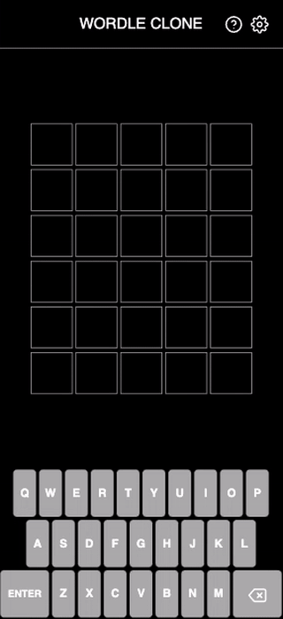

# wordle-clone

[](https://www.npmjs.com/package/wordle-clone)
[](https://github.com/Coteh/wordle-clone/actions/workflows/ci.yml)
[](https://gitpod.io/#https://github.com/Coteh/wordle-clone)

### [**Click here to play on browser**](https://coteh.github.io/wordle-clone)



A clone of the worldwide phenomenon known as [Wordle](https://www.powerlanguage.co.uk/wordle/).

Can be played on either the browser or the command line.

## Features

- Base browser game
- Also playable on the terminal
- Share functionality (using OS-native share sheet or copy to clipboard as fallback)
- Countdown to next day's Wordle
- Mobile-friendly web app 
  - Installable to mobile home screens as an app
  - Runs in fullscreen
  - Playable offline
- Hard Mode
- High Contrast Mode
- Themes
  - Dark
  - Light
  - Snow
- Tap and hold backspace to clear input
- QWERTY, Dvorak, and Alphabetical on-screen keyboards
- Changelog Dialog
    - Shows the contents of [CHANGELOG.md](CHANGELOG.md) in a dialog box in-game
    - Uses [marked](https://github.com/markedjs/marked) to parse the changelog markdown file into HTML to be displayed in the dialog
      - Does it during build time to avoid having to bundle the markdown parser in the final build

## Setup

### Browser

[Click here to play on the browser](https://coteh.github.io/wordle-clone)

### CLI

Assuming you have [Node.js](https://nodejs.org) and npm installed, run the following command to install the game:

```
npm install -g wordle-clone
```

Now you can run it using the following command:

```
wordle
# or, alternatively:
# wordle-clone
```

#### CLI arguments

```
  -d, --difficulty <string>  change game difficulty (choices: "hard", "easy")
  -v, --verbose              print extra information
  -h, --help                 display help for command
  -V, --version              output the version number
```

#### Preferences

Preferences are stored in the following locations (depending on OS):
- `$HOME/.config/wordle-clone/preferences.json` (Linux)
- `/Users/<username>/Library/Application Support/wordle-clone/preferences.json` (macOS)
- `C:\Users\<username>\AppData\Roaming\wordle-clone\Config\preferences.json` (Windows)

To find where it's located on your machine, you can use the Game Data Subcommand (see [Game Data Subcommand Usage](#game-data-subcommand-usage) for full usage). You can output the preferences filepath by running `wordle data -p`.

In this file, you can specify the following options in JSON format:
| Option | Type | Description | Default Value |
| ------ | ---- | ----------- | ------------- |
| `hardMode` | `boolean` | Whether to enable hard mode | `false` |
| `highContrast` | `boolean` | Whether to turn on high contrast mode | `false` |

Example:
```
{
    "hardMode": true,
    "highContrast": false
}
```

##### Game Data Subcommand Usage

```
Usage: wordle-clone data [options]

outputs the filepath of game state and/or preferences

Options:
  -p, --preferences  output preferences filepath
  -s, --state        output game state filepath
  -h, --help         display help for command
```

##### Uninstalling CLI

You can use the command `wordle data -s` to find the state file on your machine, as well as `wordle data -p` to find the preferences file on your machine.

Uninstalling the game and all its data from your machine is as simple as deleting those underlying directories, then running:

```
npm uninstall -g wordle-clone
```

## Development

Clone this repository, then run the following:

```
npm install
```

It's also a good idea to scramble the words when working on the project, to prevent spoilers:

```
./scripts/gen_word_list.sh
```

(Note: If you're on Windows, run the script in WSL)

The following will make it so that git doesn't detect that `words.txt` changed:

```
git update-index --assume-unchanged words.txt
```

At this point, run the following to start a local dev server:

```sh
npm run dev
```

The game should render when navigating to http://localhost:5500.

### HTTPS Local Development

The share feature uses the share sheet provided by the browser/OS and can also fall back to the browser's clipboard feature if the share sheet isn't available. Both of these features need a secure context to operate, requiring the use of a local HTTPS server when developing them. However, the game can still run on a HTTP server, where it will default to legacy clipboard functionality.

Using [mkcert](https://github.com/FiloSottile/mkcert), run the following commands to setup local certificates to be used by local HTTPS server:

```sh
# run this on elevated shell on Windows
mkcert -install

# run this command to generate a local cert
mkcert --cert-file ssl/local.pem --key-file ssl/local-key.pem localhost 127.0.0.1 ::1

# or, run the following to have it generate a cert that also contains your local network IP
./scripts/gen_mkcert_cert.sh
```

The root certificate authority (CA) file also needs to be installed on the device in order for the cert to be recognized.

#### iOS Instructions

1. Find the root CA file (`rootCA.pem`)

  - run `mkcert -CAROOT` to see where the file is located on your machine

2. Transfer to device (via AirDrop, etc.)

1. There should be a prompt right away to install it, otherwise find it in Files app

1. Confirm installation

  - Profiles are in Settings -> General -> VPN & Device Management

5. To trust the certificate, go to Settings -> General -> About -> Certificate Trust Settings

1. Under "ENABLE FULL TRUST FOR ROOT CERTIFICATES," toggle on the certificate in the list (it should be listed)

#### Android Instructions

TODO

#### Running the HTTPS dev server

Then run the following to start up the local HTTPS server:

```sh
npm run devs
```

The game should render when navigating to https://localhost:5501.

### Optional Components

#### Nonprod App Icon

With [ImageMagick](https://imagemagick.org/) installed, both the build script and the dev server are capable of generating a version of the app icon with a label (e.g., "LOCAL", "DEV") at the bottom. This helps distinguish the local version of the app from the production build when saving it to the home screen.


For systems without ImageMagick, the pregenerated version of the icon in the repo is used.

To generate icons with different labels, pass the label as an argument to `./scripts/gen_nonprod_icon.sh`.

Example:
```sh
./scripts/gen_nonprod_icon.sh DEV
```

This command creates icons with the "DEV" label.

The dev server always creates icons with the "LOCAL" label. For builds, any label can be specified by including it as the first argument for the build command.

Example:
```sh
npm run build -- DEV
```

This command creates icons with the "DEV" label and copies them to the build output.

## Testing

Run the following to launch unit tests:

```
npm run test
```

Cypress tests can be accessed by running the following:

```
npm run cypress open
```

This will launch the tests in the Cypress UI. 

Alternatively, you can run the tests directly on CLI:

```
npm run cypress run
```

## Future Additions

- Player Statistics
- Archive
- Animations
